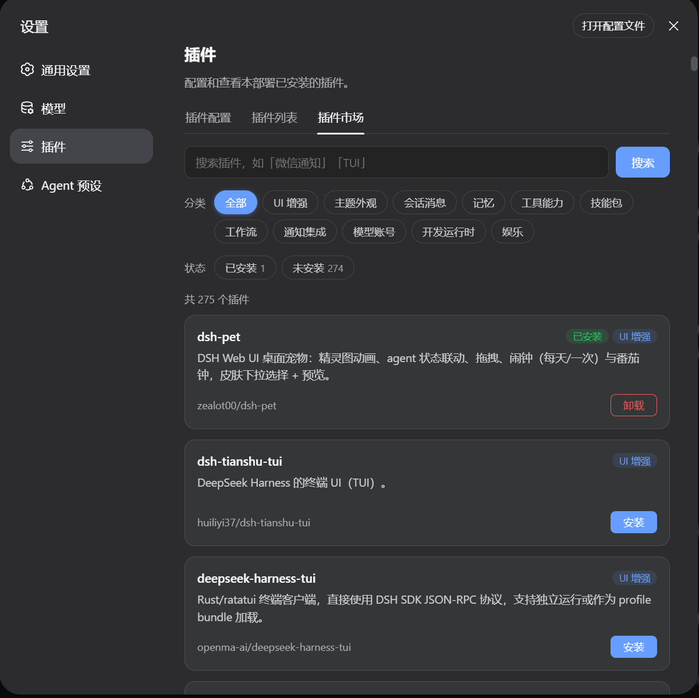

<p align="center">
  <a href="https://beancookie.github.io/awesome-dsh-plugin/">
    
  </a>
</p>

# Awesome DeepSeek Harness (DSH) Plugin

<p align="center">
  <a href="https://awesome.re"></a>
  <a href="https://beancookie.github.io/awesome-dsh-plugin"></a>
</p>

<p align="center">
  English | <a href="README.md">中文</a>
</p>

> A curated list of plugins for [DeepSeek Harness](https://github.com/deepseek-ai/deepseek-harness) (`dsh`).

DeepSeek Harness is DeepSeek's open-source agent harness — a runnable coding agent (Web and headless), built on a framework where everything is a plugin: models, tools, sandboxes, session storage, UI, even the agent loop itself. Plugins can extend the official coding agent, swap out its core parts, or assemble something entirely different.

<p align="center">
  Recommended: <a href="https://github.com/beancookie/dsh-plugin-registry">dsh-plugin-registry</a> — search and install plugins from this curated list right inside DSH, with a plugin-market panel in Web settings.
</p>

<details>
<summary align="center">📸 Click to view screenshot</summary>

<p align="center">
  
</p>

</details>

**371** plugins · [PRs welcome](#contributing)

## Contents

- [Plugins](#plugins)
  - [UI Enhancements](#ui-enhancements)
  - [Themes & Appearance](#themes--appearance)
  - [Sessions & Messages](#sessions--messages)
  - [Memory](#memory)
  - [Tools & Capabilities](#tools--capabilities)
  - [Skills](#skills)
  - [Workflow & Automation](#workflow--automation)
  - [Notifications & Integrations](#notifications--integrations)
  - [Models & Providers](#models--providers)
  - [Development & Runtime](#development--runtime)
  - [Just for Fun](#just-for-fun)
- [Related](#related)
- [Contributing](#contributing)
- [Badge](#badge)
- [Disclaimer](#disclaimer)

## Plugins

### UI Enhancements
- [0xsline/dsh-spotlight](https://github.com/0xsline/dsh-spotlight) - Keyboard-first command palette for the DSH Web UI.
- [a903067276-rgb/dsh-file-mentions](https://github.com/a903067276-rgb/dsh-file-mentions) - Clickable file paths in DSH replies: Codex-style inline open, reveal in file manager, and a mentioned-files chip list at the turn tail.
- [a903067276-rgb/dsh-hud](https://github.com/a903067276-rgb/dsh-hud) - HUD status panel: Git status, MCP servers, skills, model and token usage in a floating side panel.
- [AKIRACOD/dsh-drag-and-drop](https://github.com/AKIRACOD/dsh-drag-and-drop) - File-drag fork: drop documents as removable chips above the composer, send without typing.
- [alingalingling/ui-status-label](https://github.com/alingalingling/ui-status-label) - Customize the "deep diving" thinking status label to anything you like.
- [asukasec/dsh-message-preview](https://github.com/asukasec/dsh-message-preview) - Right-edge user-message navigator with an adaptive block layout that fits the available height, plus hover previews, keyboard controls, and click-to-jump navigation.
- [BeiZi6/dsh-opencodego-usage](https://github.com/BeiZi6/dsh-opencodego-usage) - OpenCodeGo quota monitor for the DSH Web GUI: a breathing indicator at the input's bottom-right (green/yellow/red by remaining share), a liquid-glass panel with rolling/weekly/monthly usage windows and reset times, auto-refreshing every 30 s; API key read from DSH credentials.
- [bill9109/dsh-101](https://github.com/bill9109/dsh-101) - Document reading mode for DSH.
- [bill9109/dsh-drag-and-drop](https://github.com/bill9109/dsh-drag-and-drop) - Cross-platform file drag-and-drop with raw path insertion, no file copying.
- [bobcat848/dsh-calculator](https://github.com/bobcat848/dsh-calculator) - DeepSeek API spend (current session and all sessions) and account balance in the aside panel, with official pricing and peak/off-peak support.
- [dsh-web-billing](https://github.com/bpc-oss/dsh-web-billing) - RMB/USD token billing with official-policy pricing and a per-message cost ledger.
- [dsh-web-review](https://github.com/CanglongCl/dsh-web-review) - Isolated web page previews with element annotations that guide source edits.
- [ccch1mneyyy/dsh-TUI](https://github.com/ccch1mneyyy/dsh-TUI) - Claude Code-style full-screen terminal UI: pixel-whale header, live status line, and streaming thought expansion.
- [ccq1/dsh-side-panel](https://github.com/ccq1/dsh-side-panel) - Side panel with file browser, terminal, and Git review for quick file previews.
- [daetz-coder/dsh-multi-chat](https://github.com/daetz-coder/dsh-multi-chat) - A multi-window wall for the DSH Web UI: run and monitor N conversations side-by-side in one screen, with auto-discovery, per-window controls, and an authenticated LAN gateway for phone/tablet access.
- [dingyi222666/dsh-focus-chat](https://github.com/dingyi222666/dsh-focus-chat) - A "focus chat" minimal view that shows only final outputs.
- [dsh-paste-input](https://github.com/dsh-external/dsh-paste-input) - Ctrl+V paste files / drag & drop / picker.
- [dsh-web-panel](https://github.com/dsh-external/dsh-web-panel) - Embedded terminal dock + Git review + file view.
- [fishxcode/dsh-plugin-deepseek-balance](https://github.com/fishxcode/dsh-plugin-deepseek-balance) - DeepSeek API balance, balance trend, and daily usage charts in DSH Web settings.
- [Ghost011118/dsh-balance-meter](https://github.com/Ghost011118/dsh-balance-meter) - DeepSeek account balance and session cost in the composer dock, with auto-fetched official pricing and peak/off-peak support.
- [context-vista](https://github.com/GooodWei/context-vista) - Right-side floating panel with a live donut chart of context token usage and cost.
- [Han-1413141/dsh-cost-meter](https://github.com/Han-1413141/dsh-cost-meter) - Per-session and daily API cost, budget with usage %, official balance, history dashboard, and one-click official price sync with peak/off-peak pricing.
- [Han-1413141/dsh-sticky-disclosure](https://github.com/Han-1413141/dsh-sticky-disclosure) - One-click collapse of every expanded section (Think rows, tool cards) with a live-count pill and a customizable hotkey.
- [huiliyi37/dsh-tianshu-tui](https://github.com/huiliyi37/dsh-tianshu-tui) - A terminal UI (TUI) for DeepSeek Harness.
- [jiangnanquan/dsh-ux](https://github.com/jiangnanquan/dsh-ux) - Solarized light theme, compact layout, think/tool-chain collapse capsules, and balance, session cost, and usage dashboards for the DSH web UI.
- [Jolly-J/dsh-deepseek-billing](https://github.com/Jolly-J/dsh-deepseek-billing) - DeepSeek account balance and per-session cost card in the sidebar foot.
- [l541402398/dsh-file-uploads](https://github.com/l541402398/dsh-file-uploads) - Upload arbitrary local files from the Web composer, show pending cards, and manage stored files in Settings.
- [lak321/dsh-filetree](https://github.com/lak321/dsh-filetree) - Project file browser: per-session file tabs, a directory tree, and a VSCode-style editor (C syntax highlighting, line numbers, auto-indent, status bar) that follows the current workspace.
- [lancecheney/dsh-deepseek-balance](https://github.com/lancecheney/dsh-plugins/tree/main/packages/dsh-deepseek-balance) - A real-time billing badge left of the Session log button: balance, per-conversation spend, peak/off-peak/flat pricing, auto-switching by model/currency/effort, daily official pricing fetch.
- [Lanxing6480/dsh-galgame](https://github.com/Lanxing6480/dsh-galgame) - A visual-novel presentation layer for the DSH Web chat view: portrait diffs, streaming thought bubble, typewriter dialogue, and GalGame-style question/approval panels; switch back to the normal chat anytime.
- [Laplace-bit/dsh-smooth-stream](https://github.com/Laplace-bit/dsh-smooth-stream) - Silky streaming reveal for the Web UI: text appears at the model's arrival rate, new lines glide in, no flicker; follow stays with the user and `prefers-reduced-motion` is respected.
- [lehhair/dsh-diff-viewer](https://github.com/lehhair/dsh-diff-viewer) - PiUI-style diff viewer replacing the stock DiffBlock for write/edit tool calls.
- [dsh-pi-tui](https://github.com/lqhl/dsh-pi-tui) - Differential-rendering TUI front end with streaming markdown and tool cards.
- [Luaphes/dsh-web-attention-badge](https://github.com/Luaphes/dsh-web-attention-badge) - Attention reminders: frame badge, tab-title count, and a status-colored whale favicon for sessions waiting for input or finished unopened.
- [Meredith2328/dsh-sticky-note](https://github.com/Meredith2328/dsh-sticky-note) - Quick sticky notes on the composer toolbar: jot ideas or TODOs, auto-saved as Markdown, one click to send into the chat.
- [dsh-plugin-description](https://github.com/MysaDC/dsh-plugin-description) - Bilingual descriptions on every plugin card in the Web Settings plugin list.
- [Nagi-ovo/dsh-visualize](https://github.com/Nagi-ovo/dsh-visualize) - In-conversation generative UI: the model renders interactive HTML cards into the chat stream, with streaming preview and sandboxed rendering.
- [nonewind/dsh-spend](https://github.com/nonewind/dsh-spend) - Token usage and estimated spend for the dsh web UI: floating panel with per-model, per-day, and per-session stats.
- [omdsh-dev/dsh-annotation](https://github.com/omdsh-dev/dsh-annotation) - Select text → annotate → send with your message; replies map back to each annotation.
- [omdsh-dev/dsh-at-file](https://github.com/omdsh-dev/dsh-at-file) - Codex-style `@file` mentions: search workspace files in the composer and attach their contents to prompts.
- [omdsh-dev/DSH-better-sidebar](https://github.com/omdsh-dev/DSH-better-sidebar) - Full sidebar workbench with file rendering and editing, terminal, Git, and subagents; third-party plugins can register new tabs.
- [omdsh-dev/dsh-genui](https://github.com/omdsh-dev/dsh-genui) - Interactive UI components rendered inline in replies: layout, charts, forms, quizzes, mermaid, 3D scenes, and an action event loop back to the model.
- [omdsh-dev/ex-setting](https://github.com/omdsh-dev/ex-setting) - Settings extensions for DSH.
- [omdsh-dev/web-components](https://github.com/omdsh-dev/web-components) - Web Components support.
- [openma-ai/deepseek-harness-tui](https://github.com/openma-ai/deepseek-harness-tui) - A Rust/ratatui terminal client that speaks the DSH SDK JSON-RPC protocol directly and runs standalone or as a profile bundle.
- [pk7j7sqryy-ops/dsh-token-pet](https://github.com/pk7j7sqryy-ops/dsh-token-pet) - Cute token-usage widget in the session header: a Bubu doll plus context occupancy, session usage and breakdown, with date/weekday, weather, 3-day forecast and severe-weather alerts (raindrop/snowflake animation), following the theme color.
- [qyw233/dsh-deeplink](https://github.com/qyw233/dsh-deeplink) - Deep links: open a specific session or workspace via `?session=` / `?workspace=`.
- [renat3u/dsh-web-archive](https://github.com/renat3u/dsh-web-archive) - Collapse noisy messages (Think, Bash, etc.) in conversations.
- [Sev7een/ds-api-usage](https://github.com/Sev7een/ds-api-usage) - DeepSeek API balance and 24-hour usage dashboard in Settings, with estimated spend, token counts, request counts, and an hourly timeline.
- [dsh-turn-index](https://github.com/Simon314620/dsh-turn-index) - Turn-index sidebar with scroll-spy highlighting.
- [SnowCrescenter-tech/dsh-milestone](https://github.com/SnowCrescenter-tech/dsh-milestone) - Right-side dot-timeline rail: jump between user messages.
- [Starfie1d1272/dsh-builtin-toggles](https://github.com/Starfie1d1272/dsh-builtin-toggles) - Adds a built-in plugin catalog to DSH Web with search, status explanations, and safe toggles for audited UI plugins.
- [stopchewing/dsh-mcp-view](https://github.com/stopchewing/dsh-mcp-view) - MCP servers & tools inventory panel: one-click floating panel from the sidebar that lists every MCP server and tool (transport, endpoint, JSON schema, last-used time), grouped by server, collapsed by default, with live search and refresh; last-used times come from real session logs.
- [Sttrevens/dsh-cost-meter](https://github.com/Sttrevens/dsh-cost-meter) - Per-turn USD cost badge in the Web UI: session total in the header and per-turn cost in each message footer, with a hover breakdown.
- [v587d/dsh-opencode-go-usage](https://github.com/v587d/dsh-opencode-go-usage) - OpenCode Go subscription usage (rolling/weekly/monthly windows with reset countdowns) in the composer dock, with a built-in credential editor.
- [vibeinging/dsh-turn-navigator](https://github.com/vibeinging/dsh-turn-navigator) - Turn navigation for the DSH Web UI.
- [vlln/dsh-navbar](https://github.com/vlln/dsh-navbar) - Conversation node navigation bar for quick jumps between user messages.
- [vlln/dsh-task-status](https://github.com/vlln/dsh-task-status) - Background task status bar: progress plus live output tail on the chat page.
- [WFMinerva/dsh-turn-cost](https://github.com/WFMinerva/dsh-turn-cost) - Per-turn real cost under every assistant reply: CNY at official peak/off-peak rates with cache-hit ratio; reads local session logs only, zero telemetry, zero keys.
- [wsxwj123/dsh-plugins#turn-scrubber](https://github.com/wsxwj123/dsh-plugins/tree/main/packages/turn-scrubber) - Compact right-edge turn rail with hover summaries and click-to-jump navigation.
- [xiaogu619520/dsh-plugin-task-panel](https://github.com/xiaogu619520/dsh-plugin-task-panel) — Task & Context Summary Floating Panel (todo tracking, file/system token breakdown, 8-way resize, shortcut).
- [yoli-mi/dsh-client-ui-custom](https://github.com/yoli-mi/dsh-client-ui-custom) - Web theming (wallpaper, glass, accent, presets), keyboard shortcuts, usage stats, a plugin marketplace, a floating history strip, and user-message Markdown rendering.
- [dsh-plugin-workshop](https://github.com/yyyyukari/dsh-plugin-workshop) - Steam Workshop-style in-app plugin browser with one-click install/update/uninstall.
- [zealot00/dsh-pet](https://github.com/zealot00/dsh-pet) - Desktop pet for the DSH Web UI: sprite-sheet animation, agent state linkage, drag, alarm (daily/one-shot) and pomodoro widgets, skin picker with preview.
- [zh667/TokenLedger](https://github.com/zh667/TokenLedger) - Shows local DSH token usage by relay site, project, and model, with account balances and subscription quota windows.
- [Zhangbo-cn/dsh-voice-input-plugin](https://github.com/Zhangbo-cn/dsh-voice-input-plugin) - Composer microphone: click for continuous monitoring or hold to talk; browser speech recognition types words into the composer as you speak, while replies are read aloud as they stream via host Edge TTS (sentence-split), pausing recognition while reading to avoid echo, click to stop.
- [zhu1090093659/dsh-web-ui](https://github.com/zhu1090093659/dsh-web-ui) - Plugin and skin collection for the DSH Web UI: task board, Git graph, right-side panel, remote mobile UI, pet, live token stats, and a skin center.
- [ZSeven-W/dsh-openpencil](https://github.com/ZSeven-W/dsh-openpencil) - OpenPencil design preview and editing plugin.

### Themes & Appearance
- [BeiZi6/dsh-theme-plugin](https://github.com/BeiZi6/dsh-theme-plugin) - Theme studio for the DSH Web GUI: five built-in presets plus fully customizable light/dark palettes (accent, background, foreground, UI and code fonts, translucent sidebar, contrast), hot-swapped instantly and persisted in localStorage.
- [Braidy-Wu/dsh-conversation-minimap](https://github.com/Braidy-Wu/dsh-conversation-minimap) - A conversation minimap for the DSH Web GUI (ChatGPT desktop style): one evenly-spaced capsule anchor per user prompt, fish-eye bell-curve magnification on hover with full prompt preview, top/bottom edge fade, blue highlight that follows the current prompt, click to jump to the message, and automatic full-history loading.
- [dsh-skins](https://github.com/dsh-external/dsh-skins) - Web UI skins.
- [ink5897/dsh-theme-kit](https://github.com/ink5897/dsh-theme-kit) - 32 preset themes across three palettes (Morandi, Macaron, Chinese traditional), animated and static wallpapers, paper textures, per-zone opacity and text depth, plus a keyboard desktop pet.
- [dsh-custom-theme-import](https://github.com/Juryorca/dsh-custom-theme-import) - DSH Web custom theme importer: one-click import from local paths or GitHub theme collections, live preview and refresh, hosted theme library; the lightweight format lets authors edit CSS/DOM files and hot-reload, making it a friendly option for personal theme development and sharing.
- [KinGao294/dsh-skin](https://github.com/KinGao294/dsh-skin) - Codex-style skin switcher plus a custom wallpaper layer with opacity and blur controls.
- [Liu-ZA-81/dsh-theme-firefly](https://github.com/Liu-ZA-81/dsh-theme-firefly) — A Honkai: Star Rail "Firefly" theme: wallpaper/video backgrounds, firefly-green neon palette, transformation boot animation, ambient particles, BGM, typewriter SFX, and context-aware emote easter eggs.
- [dsh-odette-skin](https://github.com/lkdx0220/Genshin-odette-skin-dsh) — A Genshin Impact "Odette" themed DSH UI skin: dark/light dual-mode background images, frosted-glass overrides for 13 theme tokens, and a chibi mascot sidebar toggle; install via npm.
- [RevolutionLA/dsh-dream-skin](https://github.com/RevolutionLA/dsh-dream-skin) - One-command skinning for DSH Web: 8 original themes, wallpaper (opacity/blur/gradient/URL), per-user accent, and shareable theme-pack import/export + favorites + surprise-me. Purely native on DSH's token system.
- [Small-tailqwq/dsh-deep-whale](https://github.com/Small-tailqwq/dsh-deep-whale) - Whale-girl skin series for the DSH Web UI (maid-atelier).
- [wsxwj123/dsh-plugins#theme-gallery](https://github.com/wsxwj123/dsh-plugins/tree/main/packages/theme-gallery) - Fifteen curated theme families with complete light and dark palettes that follow the native Light, Dark, and Follow system modes.
- [xiaoyanzi191/dsh-premium-themes](https://github.com/xiaoyanzi191/dsh-premium-themes) - 8 curated color schemes plus custom palette import (name + scheme + seed colors derive a full token map), a Palette row in General settings, hot-plug install.
- [zhtx2024/dsh-skin-switcher](https://github.com/zhtx2024/dsh-skin-switcher) - Adds a Skins page to Settings that auto-discovers installed skins for one-click switching, with one-click restore to the official default look.

### Sessions & Messages
- [Anionex/dsh-turn-rewind](https://github.com/Anionex/dsh-turn-rewind) - Rewind conversation and workspace state, powered by a persistent Change Ledger.
- [bill9109/dsh-conversation-share](https://github.com/bill9109/dsh-conversation-share) - Share any excerpt of a conversation.
- [Buyi-wsgzg/dsh-sidechain](https://github.com/Buyi-wsgzg/dsh-sidechain) - `/side` persistent side sessions and `/btw` one-shot side questions, run in a temporary fork without touching main history.
- [chenproton/dsh-history](https://github.com/chenproton/dsh-history) - Browse every message you sent in the current session: full-history listing with newest-first sort, text filter, one-click copy, and click-to-jump that auto-loads earlier history when the target is not yet loaded.
- [Chinesezjc/dsh-interconnect](https://github.com/Chinesezjc/dsh-interconnect) - Cross-instance message and event handoff between DSH instances via an interconnect server.
- [czm15053/dsh-peer-link](https://github.com/czm15053/dsh-peer-link) - Let dsh and Claude Code sessions message each other directly; comes with a clickable peer list card (sort/search/send/refresh).
- [dsh-session-search](https://github.com/dsh-external/dsh-session-search) - Index-free read-only search across dsh/Codex/Claude Code/pi/OpenCode sessions.
- [edfrey0044/dsh-unarchive](https://github.com/edfrey0044/dsh-unarchive) - Restore archived sessions: a /unarchive command and an unarchive_session tool that remove sessions from the archive set so they reappear in the workspace at their original position (archiving never deletes data).
- [flyingtimes/dsh-trajectory-reader](https://github.com/flyingtimes/dsh-trajectory-reader) - Trajectory interpretation tab: summarizes each user round — what was wanted and how the assistant fulfilled it (needs/thinking/execution/results) via a rules engine plus optional LLM narrative; files, commands and errors at a glance; user messages stay verbatim.
- [futongxu9-maker/dsh-msgrail](https://github.com/futongxu9-maker/dsh-msgrail) - Message-index rail at the conversation's right edge: one brand-colored dot per user message, hover to preview, click to jump, auto-loads older history; pure plugin with no host patching.
- [hellodigua/dsh-share](https://github.com/hellodigua/dsh-share) - Share your conversations with one click.
- [Jesse-njx/dsh-crosstalk](https://github.com/Jesse-njx/dsh-crosstalk) - Cross-session messaging for DSH: any session on the machine can list and message any other, Claude Code-style, via a local heartbeat registry and inbox.
- [session-titler](https://github.com/JohnXu22786/session-titler) - Two-phase session captioning: instant keyword captions while busy, budget-model refinement when idle.
- [Moeblack/dsh-message-edit](https://github.com/Moeblack/dsh-message-edit) - Branch-based message editing, reroll, retry, and a version timeline.
- [Moeblack/dsh-prompt-studio](https://github.com/Moeblack/dsh-prompt-studio) - Edit user and built-in system-prompt sections with live preview.
- [Nwflower/dsh-chat-import](https://github.com/Nwflower/dsh-chat-import) - Import Claude Code / Codex / ChatGPT / Cursor / Gemini / Reasonix / opencode chat histories as resumable DeepSeek Harness sessions.
- [Nwflower/dsh-file-claim](https://github.com/Nwflower/dsh-file-claim) - File claim/release protection for parallel DSH sessions on the same workspace (heartbeat stale takeover, pending 3-way merge area).
- [sjh9714/dsh-what-changed](https://github.com/sjh9714/dsh-what-changed) - Session-wide file change review. Lists every file the agent wrote this session with its hunks, counts refused writes separately from changes, and folds from a session projection.
- [Wine-Red/dsh-prompt-stash](https://github.com/Wine-Red/dsh-prompt-stash) - Local, per-session LIFO prompt stash for temporarily setting aside unfinished composer text and safely restoring it later.
- [yuezengwu/dsh-explain](https://github.com/yuezengwu/dsh-explain) - Local-first learning mode: cross-session learning threads with per-source explanations.

### Memory
- [dsh-context](https://github.com/bowenliang123/dsh-context) - Context insight panel: see what the model's context window is made of and how it evolves — composition vs. window size, per-request history, compression/injection events, and per-message token stats.
- [Breeze136/dsh-kb-rag](https://github.com/Breeze136/dsh-kb-rag) - Local literature knowledge-base RAG: 8 tools (PDF/folder/Zotero ingest, hybrid BM25+vector+reranker search, cited QA with clickable DOI links, scope/strict modes, dedup/clear/stats), all-local bge embeddings + single-file SQLite, measured 242-doc/86s ingest and sub-second hot queries on 20k chunks.
- [flymysql/dsh-memory](https://github.com/flymysql/dsh-memory) - Cross-session memory vault: remember / recall / forget tools, per-turn prompt injection, and a settings-page entry browser.
- [freehul/sgme](https://github.com/freehul/sgme) - ShiGuang Memory Engine (SGME) bridge: multi-agent shared long-term memory via HTTP — L0/L1/L1.5/L2 distillation, scenario-based injection, unified search, and proactive care signals (memory_search / wiki_search / signal_pull / signal_claim / signal_ack), installable as `dsh-sgme`.
- [futongxu9-maker/dsh-shared-memory](https://github.com/futongxu9-maker/dsh-shared-memory) - Cross-conversation shared memory: MEMORY.md + USER.md injected into every session's system prompt, with a memory tool and a GUI panel (Hermes-style).
- [ICCuse/dsh-file-memory](https://github.com/ICCuse/dsh-file-memory) - File-backed working memory: memorize/recall key premises verbatim in a session notes file so they survive context compaction losslessly.
- [ICCuse/dsh-knowledge](https://github.com/ICCuse/dsh-knowledge) - Bridge into a global Markdown knowledge base shared with the Codex kb.cmd CLI: kb_add/kb_search/kb_show/kb_timeline tools with byte-compatible frontmatter.
- [ICCuse/dsh-premise-guard](https://github.com/ICCuse/dsh-premise-guard) - Post-compaction premise-drift guard: injects a one-shot notice when a compaction summary drops a critical literal anchor.
- [Jesse-njx/dsh-memory](https://github.com/Jesse-njx/dsh-memory) - Cited memory over DSH's lossless session log: distilled facts carry `(sessionId, eventRange)` citations that expand back to the exact original log excerpt.
- [memory-vault](https://github.com/JohnXu22786/memory-vault) - Cross-session persistent memory for coding agents: SQLite local storage, hybrid keyword/semantic retrieval, Web and MCP interfaces.
- [LoserFox/distill](https://github.com/LoserFox/distill) - Automatic conversation distillation: background subagent reflection + skill create/update.
- [modusensus/dsh-mneme](https://github.com/modusensus/dsh-mneme) - Cross-session memory: SQLite with a human-editable Markdown mirror, background consolidation (dedup, merge, conflict resolution), and six memory tools.
- [nowledge-co/nowledge-mem-deepseek-harness](https://github.com/nowledge-co/nowledge-mem-deepseek-harness) - One memory layer for every AI tool and agent: Context Bundle injection, prompt-time recall, MCP tools, and turn-end DSH thread capture.
- [omdsh-dev/dsh-mnemon](https://github.com/omdsh-dev/dsh-mnemon) - Deep Mnemon integration: local three-tier memory (Runtime Memory, retrievable Documents, supervised Memory Spaces).
- [PerryLink/dsh-memento](https://github.com/PerryLink/dsh-memento) - Bounded, layered, approval-gated, auditable cross-session memory: a typed `ctx.memory` seam with a zero-dependency SQLite provider, a `memory` tool, and frozen snapshot injection; every write passes the approval gate and stays reconstructable from the session log.
- [Phant0Meow/dsh-memory-meow](https://github.com/Phant0Meow/dsh-memory-meow) - Project-scoped cross-session memory: PROJECT.md snapshot injected into the first user message, a memory_remember tool, and auto-reflection after ReAct tasks; each project keeps its own memory file.
- [billion-context-dsh](https://github.com/Tyan66666/billion-context-dsh) - Model-driven context compression: the model decides when and what to compress.
- [Xplore-LAB/dsh-plugin-asmemory](https://github.com/Xplore-LAB/dsh-plugin-asmemory) - Action-state time memory: record typed states and actions, then analyze trends, anomalies, and causality.

### Tools & Capabilities
- [1na-ko/dsh-hdc-bridge](https://github.com/1na-ko/dsh-hdc-bridge) - HarmonyOS device bridge: hdc screenshot/install/log/crash/UI automation loop with read_image, official-first versioned API knowledge (SDK .d.ts + offline bundled docs), and a DevEco CLI build/sign/lint lane.
- [dsh-verify](https://github.com/263311487-ux/dsh-verify) — Independent browser acceptance testing for agent deliverables: JSON spec drives real headless Chromium, asserts computed styles and pixel diffs, returns an HTML report and 0/1 exit code; ships npm CLI, GitHub Action, and MCP server.
- [dsh-file-mount](https://github.com/acefun29/dsh-file-mount) - Incremental file mounting with read dedupe: mounted line ranges are never re-sent to the model.
- [AlloyPlane/dsh-eye-vision](https://github.com/AlloyPlane/dsh-eye-vision) - Vision bridge for text-only models: image_understand tool via any OpenAI-compatible multimodal API (OCR/UI analysis), with an allowed-directories whitelist.
- [Anionex/dsh-computer-use](https://github.com/Anionex/dsh-computer-use) - Accessibility-first macOS computer use: fresh observations, stale-state rejection, scoped permissions, and safe input.
- [Anionex/dsh-vision-toolkit](https://github.com/Anionex/dsh-vision-toolkit) - Vision tasks for text-only models: intent-aware image Q&A, long-screenshot OCR, UI reproduction, grounding, and pixel diff.
- [Anlushu/hkinsure](https://github.com/Anlushu/hkinsure) — Hong Kong insurance data MCP: 260+ real products, 17 insurers, dividend fulfillment rates. Query/compare/calculate for any AI tool (Hermes / dsh / Claude Code).
- [awesome-dsh-plugin/dsh-find-plugin](https://github.com/awesome-dsh-plugin/dsh-find-plugin) - Find plugins without leaving the agent: search this curated registry by keyword or category, with ready-to-run install commands.
- [beancookie/dsh-plugin-anydoc](https://github.com/beancookie/dsh-plugin-anydoc) - Registers @firecrawl/anydoc as an `anydoc` tool for the Agent, converting Word/PPT/Excel/PDF/EPUB and other document formats into GitHub-Flavored Markdown.
- [dsh-news-plugin](https://github.com/canghai666x/dsh-news-plugin) - RSS news fetch tool that grabs 10+ CN/EN feeds into structured items.
- [cdxiaodong/dsh-llm-inspector](https://github.com/cdxiaodong/dsh-llm-inspector) - Unified LLM request/response inspector: reasoning-effort tuning, external-think export, traffic & bundle analysis.
- [dsh-learn-everything](https://github.com/cendaifeng/dsh-learn-everything) - Feynman learning-mode loop rendered as rich HTML lesson cards.
- [dsh-harness-mcp-server](https://github.com/chushixixin/dsh-harness-mcp-server) - MCP server that lets any MCP client drive the Harness agent.
- [dsh-report-studio](https://github.com/ciceroyang/dsh-report-studio) - Turn a DSH session into daily/weekly/handoff/article reports with verifiable receipts.
- [browser4-dsh](https://github.com/dsh-external/browser4-dsh) - Browser4 AI-native browser engine exposed as skills.
- [dsh-browser-panel](https://github.com/dsh-external/dsh-browser-panel) - Headed browser embedded in the WebUI, model-driven and zero vision deps.
- [dsh-office](https://github.com/dsh-external/dsh-office) - Model reads/edits Office files with docx/pdf preview in the web client.
- [dsh-market/dsh-market](https://github.com/dsh-market/dsh-market) - The plugin market inside DSH: a Settings page to browse and search the full community catalog by category, with confirmed one-click installs and an installed-plugins view.
- [EvilIrving/dsh-context-proxy](https://github.com/EvilIrving/dsh-context-proxy) - Thin on-demand context retrieval: context_query / context_slice / context_grep tools that read already-persisted history back with replay-safe citations.
- [flymysql/dsh-remote](https://github.com/flymysql/dsh-remote) - Remote workspace: connect a host over SSH (password or key), pick a remote workspace directory and operate on it with rw_pick_workspace / rw_list_dir / rw_read_file / rw_exec tools.
- [futongxu9-maker/dsh-path-reveal](https://github.com/futongxu9-maker/dsh-path-reveal) - Click any absolute Windows path in DSH messages to reveal it in Explorer (select the file or open the folder).
- [gloryxpnv/dsh-tool-vision](https://github.com/gloryxpnv/dsh-tool-vision) - Local-first vision for the text-only DeepSeek Harness: a local VLM (LM Studio / Ollama / vLLM) produces structured JSON evidence (OCR / layout / semantics) at zero API cost, with image data never leaving the machine.
- [gongyijie85/dsh-repo-setup](https://github.com/gongyijie85/dsh-repo-setup) - Read-only repo bootstrap scanner (repo_setup_scan tool): detects stack/tests/docs/git/db hints and recommends skill plugins, MCP servers and hygiene files (claude-code-setup counterpart).
- [Gumiho12345/dsh-plugin-net-access](https://github.com/Gumiho12345/dsh-plugin-net-access) - Net Access permission mode: keeps workspace-write protection while making curl.exe HTTPS work inside the sandbox (Windows).
- [hccccc01333/dsh-excel-chat](https://github.com/hccccc01333/dsh-excel-chat) - Talk to Excel in DeepSeek Harness: create, edit, repair, and verify spreadsheets by conversation, with automatic formula health checks after every edit.
- [HuanLinOTO/dsh-plugin-mineru](https://github.com/HuanLinOTO/dsh-plugin-mineru) - Expose MineRU document parsing tools to the model.
- [huey1in/trio](https://github.com/huey1in/trio) - Browser automation (Playwright) with a live view, an MCP server exposing DSH agents to any MCP client, and GitHub issue/PR/webhook review tools.
- [IWAIBAOLI/dsh-with-pencil](https://github.com/IWAIBAOLI/dsh-with-pencil) - Bring the official pen.dev Pencil into DeepSeek Harness via the official CLI: in-conversation .pen editing tools, optimized specifically for DeepSeek's text-only model.
- [Jesse-njx/dsh-cowork](https://github.com/Jesse-njx/dsh-cowork) - Bounded, cell-addressed `doc_read`/`doc_write` for xlsx / pdf / docx / pptx / ipynb, plus an MCP server and CLI.
- [Jesse-njx/dsh-docker](https://github.com/Jesse-njx/dsh-docker) - Typed, guarded container control: ps/logs/inspect/exec/start/stop and compose up/down with JSON output, project-aware targeting, and approval-gated destructive ops.
- [Jesse-njx/dsh-skillport](https://github.com/Jesse-njx/dsh-skillport) - Bring your existing Agent Skills (SKILL.md) library to DSH: discover skills across Claude/Codex/Cursor/Gemini paths, inject a progressive-disclosure index, and load bodies on demand.
- [Jesse-njx/dsh-voice](https://github.com/Jesse-njx/dsh-voice) - Voice notes in, spoken answers out: dictate audio that becomes user messages (transcribe), have the agent read replies aloud (speak), local-first under ~/.dsh/voice.
- [jihongboo/dsh-apple-mode](https://github.com/jihongboo/dsh-apple-mode) - Xcode AI integration for DSH: 26 Xcode MCP tools (mcpbridge) + Apple platform skills + Xcode Intelligence-style persona (agent preset or global bundle).
- [adversarial-review](https://github.com/JohnXu22786/adversarial-review) - gavel-review: adversarial multi-perspective code review — parallel attack lenses, static sentinels, severity grading.
- [browser-automation](https://github.com/JohnXu22786/browser-automation) - Web Bridge: real-browser automation MCP server — navigation, click, form-fill, screenshots, JS execution, accessibility-snapshot driven.
- [codegraph](https://github.com/JohnXu22786/codegraph) - Code knowledge graph: indexes symbols, call sites and imports into SQLite, answers call/dependency questions.
- [command-scout](https://github.com/JohnXu22786/command-scout) - Scans declared project build commands (Makefile, package.json scripts, justfile, deno tasks) and exposes them as agent tools.
- [computer-control](https://github.com/JohnXu22786/computer-control) - Desktop control: screen capture, pointer/keyboard injection, accessibility-tree actions, confirmation flow, emergency stop.
- [context-pruner](https://github.com/JohnXu22786/context-pruner) - Session context triage: prunes stale, repeated, failed and oversized context to save token budget.
- [docs-retriever](https://github.com/JohnXu22786/docs-retriever) - doctrove: versioned library documentation retrieval MCP server, zero runtime dependencies.
- [fs-mcp](https://github.com/JohnXu22786/fs-mcp) - paddock: constrained local filesystem MCP server — file access confined to configurable zones, zero runtime dependencies.
- [github-mcp](https://github.com/JohnXu22786/github-mcp) - repogate: GitHub developer workbench MCP server — repos, issues, PRs, code review, search, zero runtime dependencies.
- [pty-runner](https://github.com/JohnXu22786/pty-runner) - Background terminal (PTY) job management: launch long-running processes, feed input, page output, stop on demand.
- [safety-net](https://github.com/JohnXu22786/safety-net) - Destructive-command interception gate: parses and requires human approval for rm -rf / git reset --hard / push --force before execution (dsh plugin + standalone CLI).
- [secret-guard](https://github.com/JohnXu22786/secret-guard) - Blocks agents from reading/writing sensitive files, masks leaked secrets in tool results, with an audit journal.
- [snippet-expander](https://github.com/JohnXu22786/snippet-expander) - Steno: inline #tag shorthand expansion before send — multi-library, aliases, {{variables}}, recursion guards.
- [statusline](https://github.com/JohnXu22786/statusline) - Real-time terminal statusline: model, context usage, sub-agents, rate limits and session time in one line.
- [worktree-mgr](https://github.com/JohnXu22786/worktree-mgr) - Task-isolated git worktrees: auto-create, sync and tear down isolated workspaces per task.
- [kunjinkao-os/dsh-mobile-gui-agent](https://github.com/kunjinkao-os/dsh-mobile-gui-agent) - Android GUI Agent with ADB screenshots, compact UI hierarchy grounding, verified iterative actions, approvals, and a Mobile Web view.
- [lak321/dsh-screen-agent](https://github.com/lak321/dsh-screen-agent) - Desktop and web automation: 📸 multi-screen screenshots, 🔍 Windows OCR (text + pixel coordinates), 🖱️ mouse click/drag, ⌨️ Chinese typing/keys, and 🪟 window activation, with battle-tested drawing in Paint (mouse acceleration compensation, canvas positioning, Bézier curves).
- [lak321/dsh-voice-chat](https://github.com/lak321/dsh-voice-chat) - Voice chat: 🎤 speech input (Web Speech, live editable interim results) plus 🔊 automatic/manual read-aloud replies (TTS), with voice, speed, pitch and recognition-language settings (Mandarin/Cantonese, etc.); fully client-side with zero keys, and Markdown is stripped before reading.
- [Letter2025/dsh-task-worktree](https://github.com/Letter2025/dsh-task-worktree) - Complete task-scoped git worktrees: per-repo manifest for durable state, worktree-<name> branches, bring-back to main or direct commit, optional carry-over of uncommitted main changes (modeled on Qoder / Codex / Claude Code).
- [lire1131/dsh-undo-plugin](https://github.com/lire1131/dsh-undo-plugin) - Undo/redo & rollback system for DSH: every config change is auto-snapshotted; undo/redo/restore to any version from the WebUI or the offline CLI/GUI tools (works even when DSH fails to boot).
- [liustack/modlens](https://github.com/liustack/modlens) - Vision bridge for text-only models: paste an image, get structured JSON evidence (OCR, layout, semantics).
- [liustack/modsearch](https://github.com/liustack/modsearch) - Web search bridge for text-only agents: ask the web or X, get structured JSON evidence (search, fetch, citations).
- [lonelymoon87/dsh-code-intel](https://github.com/lonelymoon87/dsh-code-intel) - Indexes workspace symbols with Tree-sitter and provides lexical or optional embedding-assisted code search.
- [lsjspl/dsh-plugin-grok2api-media-tool](https://github.com/lsjspl/dsh-plugin-grok2api-media-tool) - Gives dsh the ability to generate images and videos through the grok2api API.
- [Luke-Yong/dsh-plugin-knowledge-graph](https://github.com/Luke-Yong/dsh-plugin-knowledge-graph) - A read_graph tool backed by a codebase knowledge graph (CONTAINS / EXPORTS / IMPORTS / IMPORTS_SYMBOL relations).
- [Lum1104/dsh-browser](https://github.com/Lum1104/dsh-browser) - Chrome sidebar extension that lets DSH operate your browser directly, no vision capabilities required.
- [dsh-tool-git](https://github.com/lxj808624/dsh-tool-git) - Structured Git tools (status/diff/log/branch/stage/commit) with a destructive-command guard.
- [lynx-gt/dsh-subagent-cwd](https://github.com/lynx-gt/dsh-subagent-cwd) - Extends dsh-subagent-tools with a per-call cwd for subagents, shipped with the two in-process provider patches it requires.
- [lynx-gt/dsh-subagent-tools](https://github.com/lynx-gt/dsh-subagent-tools) - Per-call model, provider, persona, and toolFilter overrides for subagent delegation, with @preset: references and provider/model composite ids.
- [lzszq/dsh-scholar](https://github.com/lzszq/dsh-scholar) - Academic assistant plugin.
- [MAXeaglet/dsh-bash-terminal](https://github.com/MAXeaglet/dsh-bash-terminal) - One shell tool for PowerShell / Git Bash / WSL on Windows plus an interactive PTY terminal; the default terminal is chosen by the user in DSH settings.
- [moon09300731/dsh-approval-gate](https://github.com/moon09300731/dsh-approval-gate) — Risk-gated approval automation: flash pre-classifies whether a write/command is irreversible — safe operations are auto-approved, dangerous ones are escalated to human approval (fail-safe).
- [moon09300731/dsh-vision-tools](https://github.com/moon09300731/dsh-vision-tools) — Full vision-capability bundle for DeepSeek Harness: a `vision_understand` tool (OpenAI-compatible vision APIs, free Zhipu GLM-4V-Flash by default) plus paste/drag-and-drop/button entry points for image recognition.
- [omdsh-dev/dsh-custom-tool](https://github.com/omdsh-dev/dsh-custom-tool) - Create and manage sandboxed JavaScript tools with a Monaco editor.
- [omdsh-dev/dsh-data-agent](https://github.com/omdsh-dev/dsh-data-agent) - Let the AI connect to databases and write SQL for you.
- [omdsh-dev/dsh-kb-sieve](https://github.com/omdsh-dev/dsh-kb-sieve) - Build auditable KB packs (SQLite FTS5) from md/txt/docx/pdf with deterministic retrieval and original-text reading.
- [omdsh-dev/dsh-tool-calculator](https://github.com/omdsh-dev/dsh-tool-calculator) - Safe math expression evaluator, zero-dependency recursive-descent parser.
- [omdsh-dev/dsh-tool-csv](https://github.com/omdsh-dev/dsh-tool-csv) - Parse/query/aggregate/convert CSV (RFC 4180) with a zero-dependency state-machine parser.
- [omdsh-dev/dsh-tool-diff](https://github.com/omdsh-dev/dsh-tool-diff) - Structured comparison and unified diffs for text/JSON/CSV/Markdown.
- [omdsh-dev/dsh-tool-encoding](https://github.com/omdsh-dev/dsh-tool-encoding) - base64/url/hex encoding, common hashes, and UUID generation.
- [omdsh-dev/dsh-tool-json](https://github.com/omdsh-dev/dsh-tool-json) - JSON queries with a JMESPath subset.
- [omdsh-dev/dsh-tool-markdown](https://github.com/omdsh-dev/dsh-tool-markdown) - HTML↔Markdown conversion, GFM table normalization, and TOC generation.
- [omdsh-dev/dsh-tool-regex](https://github.com/omdsh-dev/dsh-tool-regex) - Test/extract/safe-replace/statically explain regexes without executing code.
- [omdsh-dev/dsh-tool-schema](https://github.com/omdsh-dev/dsh-tool-schema) - JSON Schema validation: validate/paths/explain/normalize.
- [omdsh-dev/dsh-tool-stat](https://github.com/omdsh-dev/dsh-tool-stat) - Descriptive statistics, percentiles, frequency distributions, and correlation.
- [omdsh-dev/dsh-tool-time](https://github.com/omdsh-dev/dsh-tool-time) - Strict ISO 8601 parsing, IANA timezone conversion, and UTC calendar arithmetic.
- [omdsh-dev/dsh-toolkit](https://github.com/omdsh-dev/dsh-toolkit) - Zero-dependency toolkit: time / encoding / json / calculator / csv / regex / markdown / diff / stat / schema — ten deterministic tools in one install.
- [phelpsyacht/dshmath-manim](https://github.com/phelpsyacht/dshmath-manim) - Manim CE based math animation plugin: 6 built-in templates (function/derivative/integral/geometry/polar/3D surface) plus a zero-code skill pack (math-animation / manim-codegen) - natural language to animated math videos, with AST static security validation.
- [PicGo/dsh-plugin](https://github.com/PicGo/dsh-plugin) - Upload local images and files to your image host through PicGo's existing configuration (PicGo Cloud, GitHub, S3, COS, Qiniu, or any installed uploader plugin), via a `picgo_upload` tool and a `/picgo` command.
- [PolinniZhong/dsh-omi-voice](https://github.com/PolinniZhong/dsh-omi-voice) - In-conversation read-aloud with Doubao-quality voices: every AI reply gets a 🔊 tap-to-read / auto-read toggle (off by default, state persisted), with voices synthesized by the local Omi engine (Doubao seed-tts); BYOK — keys stay in your local Keychain, the plugin stores none.
- [sakikoTGW/pack-agent](https://github.com/sakikoTGW/pack-agent) - Project .pack.json/.pack.zip into .agent-pack/modpacks/ and expose skills via a workspace allow-list.
- [SamXiaBing/dsh-adb](https://github.com/SamXiaBing/dsh-adb) - ADB device & bench operations for DSH: device discovery, structured logcat (background streaming), apk install, file pull/push, and dumpsys performance snapshots.
- [Sanqi-normal/dsh-webui-market-plugin](https://github.com/Sanqi-normal/dsh-webui-market-plugin) - In-harness plugin market for the dsh web GUI: browse the awesome-dsh-plugin.com catalog and install/uninstall plugins into a profile from Settings → Plugins → Plugin Market.
- [siweina/dsh-novel-writer](https://github.com/siweina/dsh-novel-writer) — Novel writing assistant: chapter library, sentence-pattern analysis (9 categories / emotion curve / style fingerprint), style check, plot tracking, batch import and continuation writing, with per-tool Web UI toggles.
- [taxueseek/argo](https://github.com/taxueseek/argo) - Search built for agents: multilingual coverage across web, academic, code, shopping, finance, news, and encyclopedias.
- [THU-MAIC/dsh-openmaic](https://github.com/THU-MAIC/dsh-openmaic) - OpenMAIC: classrooms, slides, interactive widgets, and Socratic teaching.
- [TonyDua/dsh-web-search-exa](https://github.com/TonyDua/dsh-web-search-exa) - Zero-config Exa web search provider for the ctx.web seam: anonymous MCP fallback without an API key, plus keyed REST search.
- [vibeinging/dsh-tool-search](https://github.com/vibeinging/dsh-tool-search) - Per-agent on-demand tool discovery and progressive schema disclosure.
- [xiaoyuyu6420/dsh-backup](https://github.com/xiaoyuyu6420/dsh-backup) - One-command backup of DSH user data: /backup, scheduled auto-backup, sha256 checksums and rotation.
- [xiehuan123/coding-coach](https://github.com/xiehuan123/coding-coach) — Coding Coach: a 35-skill bundle plus a full agent preset for non-developers (8-stage product→launch pipeline with engineering/product/UI skills), installable via npm (`dsh plugin add coding-coach`) and as a Claude Code plugin.
- [xiehuan123/dsh-deepread](https://github.com/xiehuan123/dsh-deepread) — DeepRead: deep-reading assistant with five modes (quick / deep / knowledge map with four confidence levels / Feynman reading / whole book), batch comparison, budget preflight, and transparent background-job progress, from WeChat article links / local .pdf (built-in pure-JS extractor) / pasted text, with optional MD / FreeMind / styled HTML export.
- [xiejianjun000/eco-dsh-plugins](https://github.com/xiejianjun000/eco-dsh-plugins) - L1-L4 risk-tiered permission gate (eco-permission-gate) and SM3 tamper-proof audit chain (eco-audit-chain).
- [xmutfyh/dsh-plugin-writing-guard](https://github.com/xmutfyh/dsh-plugin-writing-guard) - Academic writing guard: local-regex linter for revision-process residue, defensive writing and AI-writing tells (em-dash abuse, not-X-but-Y, LLM word spikes, rule of three), with incremental auto-audit on paper file writes (writing_audit + writing_rules).
- [yangyunsong023/dsh-sxs-anti-bot-http](https://github.com/yangyunsong023/dsh-sxs-anti-bot-http) - Anti-bot HTTP fetch tools hardened by SXS's production scraping stack (millions of requests/day): UA-pool rotation, retry with exponential backoff, anti-bot wall detection (captcha / verification challenges) and adaptive rate limiting — tools: `sxs_fetch` / `sxs_fetch_json` / `sxs_rate_status`.
- [yangyunsong023/dsh-sxs-news-collector](https://github.com/yangyunsong023/dsh-sxs-news-collector) - Trending-topics collector aggregating Baidu / Toutiao / Douyin / Weibo hot lists in one call (Weibo optional cookie), returning titles with heat values for content creators — tool: `sxs_news_hot`.
- [ylwl1997/noatmark-dsh-plugin](https://github.com/ylwl1997/noatmark-dsh-plugin) - Text hygiene as a dsh plugin: sanitize untrusted text, scan invisible characters, clean LLM formatting, and escape CSV formula injection.
- [ysr666/dsh-vision-router](https://github.com/ysr666/dsh-vision-router) - Free vision for text-only agents: built-in keyless vision chain plus pixel tools (Q&A, grounding, crop, pixel diff, colors, OCR, SVG trace, cutout, screenshots); paste an image to use it.
- [zhaoolee/notes](https://github.com/zhaoolee/notes) - Export DSH conversations as Smartisan Notes-style PNGs, or create and update Markdown notes in a configured account-scoped workspace.
- [zimai233/dsh-adhd-copilot](https://github.com/zimai233/dsh-adhd-copilot) - ADHD behavioral coaching skill: task breakdown, overwhelm management, launch rituals, and failure recovery.
- [zimai233/dsh-exam-countdown](https://github.com/zimai233/dsh-exam-countdown) - Query 64 Chinese exams (高考/考研/四六级/CPA/法考…) with rule-aware date math (2nd-Saturday, 1st-Sunday) and countdowns.
- [zimai233/dsh-figma-to-lottie](https://github.com/zimai233/dsh-figma-to-lottie) - Compile SVG paths and keyframe specs into self-contained Lottie JSON animation files.
- [zimai233/dsh-image-search](https://github.com/zimai233/dsh-image-search) - Multi-engine reverse image search aggregator: Google Lens, Baidu, Yandex, TinEye, SauceNAO, IQDB, Ascii2d.
- [zimai233/dsh-video-downloader](https://github.com/zimai233/dsh-video-downloader) - Detect and download media from Bilibili/YouTube/Douyin/Xiaohongshu with quality and format analysis.
- [zimai233/dsh-wash-calendar](https://github.com/zimai233/dsh-wash-calendar) - Recurring-habit scheduling from pure date math: next occurrence, range schedules, and overdue advice.
- [ZK-Andy/dsh-continual-evolve](https://github.com/ZK-Andy/dsh-continual-evolve) - Continual self-evolution: versioned, auditable, rollback-safe harness state (prompts, memory, skills, subagent specs) refined from session trajectories, with review gates and hot-reloaded skills.
- [zp-home/dsh-recommend](https://github.com/zp-home/dsh-recommend) - Transparent rankings and recommendations for the DSH plugin ecosystem: daily auto-fetched topic data, an open scoring model, and rank/search/recommend tools with a settings-page leaderboard.

### Skills
- [creght-dev/skills](https://github.com/creght-dev/skills) - Skills for building websites on the Creght platform: CLI pull/push sync, page and component conventions, CMS, forms, auth, SEO, publishing and version rollback.
- [dhicoc/dsh-reverse-skill](https://github.com/dhicoc/dsh-reverse-skill) - Complete reverse-skill pack (85 SKILL.md files) as a DeepSeek Harness plugin: a skill router for reverse engineering, authorized penetration testing, and security research.
- [gongyijie85/dsh-ponytail](https://github.com/gongyijie85/dsh-ponytail) - Ponytail, lazy senior dev mode, for DSH: 6 skills (ponytail, ponytail-audit, ponytail-debt, ponytail-gain, ponytail-help, ponytail-review) adapted from DietrichGebert/ponytail (MIT).
- [gongyijie85/mattpocock-skills-dsh](https://github.com/gongyijie85/mattpocock-skills-dsh) - Matt Pocock's full promoted skill set (25 SKILL.md files: grilling, writing-for-agents, wait-what, TDD, code-review, wayfinder, ask-matt router and more) as a DeepSeek Harness plugin, adapted from mattpocock/skills (MIT).
- [gongyijie85/mattpocock-skills-dsh-zh](https://github.com/gongyijie85/mattpocock-skills-dsh-zh) - Matt Pocock's skills in Chinese for DSH: all 25 SKILL.md translated to natural Chinese (technical terms kept in English with glosses), adapted from mattpocock/skills (MIT).
- [gwrsfsfeefdsfs/dsh-skill-curator](https://github.com/gwrsfsfeefdsfs/dsh-skill-curator) — Meta-skill for DSH skill experience feedback and knowledge accumulation: feeds fixes back into skills and records a searchable knowledge base (keyword + local bge semantic retrieval, 7-point write-back checklist, anti-bloat archiving), with self-validation and event-hook tools.
- [docgen](https://github.com/JohnXu22786/docgen) - Documentation workshop skill pack: pure-prompt doc generation — README, PR description, changelog, code review.
- [skill-framework](https://github.com/JohnXu22786/skill-framework) - Praxis: bundled engineering-methodology skill library (Agent Skills) for dsh, served as a Cordis plugin via ctx.skills.
- [skill-manager](https://github.com/JohnXu22786/skill-manager) - Multi-zone skill discovery, progressive disclosure, creation wizard, audit and statistics.
- [spec-driven](https://github.com/JohnXu22786/spec-driven) - keel (龙骨): spec-driven development discipline skill pack — spec first, verify assumptions, prevent over-engineering.
- [leechen298/Code2Skill](https://github.com/leechen298/Code2Skill) - Generates Function, MCP, Agent Skill, and offline test packages from existing code as an installable DSH bundle.
- [yanglaofish/dsh-skill-manager](https://github.com/yanglaofish/dsh-skill-manager) - Skill lifecycle manager for DSH: list / edit / import / enable / disable skills under a global-workspace-session three-layer model, with unified settings & conversation UI, cross-layer search and pagination.

### Workflow & Automation
- [940842546/dsh-permissions](https://github.com/940842546/dsh-permissions) - Claude Code-style permission rules engine: hard/deny/ask/allow tiers with a hard tier above full access, workspace-scoped rules, wildcard path protection, and a visual staged editor; rules persist in settings.yaml.
- [940842546/dsh-usage-billing](https://github.com/940842546/dsh-usage-billing) - Usage and cost statistics with peak/off-peak pricing after the 2026-08-17 rate change, a main-UI summary panel, per-session breakdowns, and a usage heatmap.
- [biociao/dsh-science](https://github.com/biociao/dsh-science) - Claude Science-style research workbench: ReAct research-loop engine (research_* tools), versioned artifacts with provenance (artifact_* tools), and 10 science skills for genomics/pathogens/bioinformatics.
- [btspoony/dsh-advisor](https://github.com/btspoony/dsh-advisor) - Pair a second model that passively reviews each turn and injects notes.
- [btspoony/mstar-harness](https://github.com/btspoony/mstar-harness) - Skill-driven harness/loop engineering workflow agent plugin.
- [dsh-plan-execute](https://github.com/dsh-external/dsh-plan-execute) - Dual-model plan/execute routing: a planner model thinks, an executor model acts.
- [EvilIrving/dsh-proof](https://github.com/EvilIrving/dsh-proof) - Independent read-only acceptance layer: spawns a read-only verifier before each top-level turn closes and steers non-pass gaps back into the agent.
- [fakechris/dsh-track](https://github.com/fakechris/dsh-track) - Embedded task management engine: decision-point protocol, idea capture wall, Linear-style issue store.
- [fuhefei/dsh-sentinel](https://github.com/fuhefei/dsh-sentinel) - Condition-driven wakeup: durable file/command/http/process/webhook watches that wake the agent.
- [icetomoyo/dsh_workflow](https://github.com/icetomoyo/dsh_workflow) - UltraCode-style multi-agent orchestration: a generatable, savable, governable, observable, resumable workflow layer.
- [Jesse-njx/dsh-routines](https://github.com/Jesse-njx/dsh-routines) - Scheduled agents on a cron: run a prompt on a schedule and get the digest where you already are, with overlap/missed-run/timeout safety defaults.
- [file-planning](https://github.com/JohnXu22786/file-planning) - trailmap: disk-persisted execution planning — milestone state machines, dependency tagging, audit events, retrospective notes.
- [task-board](https://github.com/JohnXu22786/task-board) - Cross-session event-sourced work ledger: task tracking, audit history, kanban export.
- [Letter2025/dsh-approval-llm](https://github.com/Letter2025/dsh-approval-llm) - Model-based permission approval: an approval-request answerer backed by a separate reviewer model.
- [Letter2025/dsh-model-failover](https://github.com/Letter2025/dsh-model-failover) - Two-level model circuit breaker with failover: trip a model or a whole provider after repeated request failures and route the next request to a configured fallback.
- [lonelymoon87/dsh-specflow](https://github.com/lonelymoon87/dsh-specflow) - Adds specification artifacts, skills, commands, goal-backed implementation, and task-progress context.
- [NanmiCoder/dsh-agent-teams](https://github.com/NanmiCoder/dsh-agent-teams) - AgentTeams multi-agent teams.
- [omdsh-dev/dsh-deep-research](https://github.com/omdsh-dev/dsh-deep-research) - Adaptive deep-research orchestrator built on the official workflow engine.
- [omdsh-dev/dsh-inspect](https://github.com/omdsh-dev/dsh-inspect) - Adversarial checkup → fix → review loop toolset.
- [odai-dsh-plugin](https://github.com/orziz/odai/tree/main/dsh/plugin) - Profile-wide DSH governance and routing bundle with configurable compaction calls and scoped local semantic memory; compatible with DSH 0.1.0-rc.6 and 0.1.0-rc.7.
- [PerryLink/dsh-doublecheck](https://github.com/PerryLink/dsh-doublecheck) - Engineering-discipline guard: grill the requirements before the first edit, enforce red/green test evidence gates, and audit the delivery with a forked adversary (grill-requirements skill + tool-policy gates).
- [Sev7een/dsh-plugin-automations](https://github.com/Sev7een/dsh-plugin-automations) - Settings-based scheduled tasks that run on time or during DeepSeek off-peak hours, with one-time and daily schedules backed by durable task state.
- [timwhitez/dsh-self-evolving](https://github.com/timwhitez/dsh-self-evolving) - Evidence-first, crash-resumable self-evolution engine for DSH: bounded Cordis candidate generation, one-shot real-Loader admission, Harbor evaluation, and an auditable journaled lineage.
- [titanwings/dsh-automation](https://github.com/titanwings/dsh-automation) - Scheduled coding runs in fresh agent sessions with auditable history.
- [titanwings/dsh-plannotator](https://github.com/titanwings/dsh-plannotator) - Plan review with anchored annotations and structured feedback back to the agent.
- [vlln/dsh-loop](https://github.com/vlln/dsh-loop) - Recurring loops: `/loop` command + loop tool + activity status bar.

### Notifications & Integrations
- [Andyqwe44/dsh-notify-win](https://github.com/Andyqwe44/dsh-notify-win) - Native Windows toast + taskbar flash for task done / approval / ask_user_question, Win10/11, npm install `dsh plugin --profile web add dsh-notify-win`.
- [BiBoyang/dsh-im-bridge](https://github.com/BiBoyang/dsh-im-bridge) - Two-way WeChat (iLink) bridge: turn-end and approval-request push, in-chat approve/reject and message injection, persistent dedup and convergent long-reply chunking; channel layer extensible to other IMs.
- [bill9109/dsh-web-ui-notify](https://github.com/bill9109/dsh-web-ui-notify) - Desktop notification reminders.
- [bill9109/dsh-webbridge](https://github.com/bill9109/dsh-webbridge) - DSH meets Kimi WebBridge.
- [bobleer/dsh-acp-for-bitfun](https://github.com/bobleer/dsh-acp-for-bitfun) - ACP bridge between BitFun and DSH.
- [cdxiaodong/dsh-island](https://github.com/cdxiaodong/dsh-island) - Bridge DSH agent sessions, tool calls, and approvals to the CodeIsland macOS notch panel over a Unix socket, with in-panel allow/deny.
- [dingyi222666/dsh-session-notification](https://github.com/dingyi222666/dsh-session-notification) - Notifications for four session states, with browser alerts and prompts.
- [dsh-feishu-notify](https://github.com/dsh-external/dsh-feishu-notify) - Feishu notifications on session end / input needed.
- [dsh-opencode-server](https://github.com/dsh-external/dsh-opencode-server) - Smooth TUI via opencode attach.
- [imetn/dsh-lark-bridge](https://github.com/imetn/dsh-lark-bridge) - Bidirectional Lark/Feishu controller for DeepSeek Harness with project and session routing, interactive cards, approvals, attachments, and task controls.
- [Jesse-njx/dsh-chatnode-wechat](https://github.com/Jesse-njx/dsh-chatnode-wechat) - Chat with, monitor, and approve your DSH agents from WeChat via the iLink gateway: text both ways, session switching, progress digests, and numbered approval prompts.
- [notifier](https://github.com/JohnXu22786/notifier) - dsh-chime: desktop signal plugin — notifications and tones when a task finishes, waits for approval, or errors out.
- [Laplace-bit/dsh-bell-notify](https://github.com/Laplace-bit/dsh-bell-notify) - Lifecycle bells and a status dot: per-event chimes synthesized live with Web Audio (zero audio files), plus a breathing indicator for agent state.
- [LoserFox/telegram](https://github.com/LoserFox/telegram) - Bridge to the Telegram Bot API: long polling, per-chat sessions, HTML formatting.
- [omdsh-dev/dsh-notification](https://github.com/omdsh-dev/dsh-notification) - Desktop notifications for turn completions, with per-outcome controls and keyword rules.
- [omdsh-dev/dsh-open-in-vscode](https://github.com/omdsh-dev/dsh-open-in-vscode) - Open DSH workspace directories in VS Code directly from the web GUI.
- [openma-ai/deepseek-harness-acp](https://github.com/openma-ai/deepseek-harness-acp) - ACP profile plugin and standalone stdio server for using the full DSH agent from Zed and other ACP clients while sharing DSH credentials and sessions.
- [dsh-notify-windows](https://github.com/SeverusZh/dsh-notify-windows) - Windows notifications, zero dependencies.

### Models & Providers
- [btspoony/dsh-llm-fallbacks](https://github.com/btspoony/dsh-llm-fallbacks) - Role-based LLM retry & fallback strategies.
- [dsh-vision](https://github.com/dsh-external/dsh-vision) - Vision bridge: view_image tool over any OpenAI-compatible VLM.
- [dylan121322/llm-adaptive](https://github.com/dylan121322/llm-adaptive) - Adaptive model routing: per-request complexity classification with automatic provider routing.
- [franksong2702/dsh-codex-connect](https://github.com/franksong2702/dsh-codex-connect) - Connect ChatGPT OAuth and OpenAI Codex models to DeepSeek Harness, with opt-in search and image tools.
- [model-catalog](https://github.com/JohnXu22786/model-catalog) - Model catalog auto-discovery: fetches model listings, pricing and capabilities from OpenAI-compatible hosts into ready-to-use config.
- [kam74515-boop/dsh-everything-oauth](https://github.com/kam74515-boop/dsh-everything-oauth) - Import local Codex, Grok, Claude, OpenCode, and CC Switch logins into DSH; pick sources and enable models in Settings.
- [omdsh-dev/Qwen-MM-Plugins](https://github.com/omdsh-dev/Qwen-MM-Plugins) - Qwen multi-modal plugin support.
- [suntianc/dsh-codex-auth](https://github.com/suntianc/dsh-codex-auth) - Reuses the Codex CLI ChatGPT login as an `openai-codex` LLM route and adds GPT Auth controls to DSH Web settings.
- [tianxia--/dsh-llm-local-token](https://github.com/tianxia--/dsh-llm-local-token) - Reuses local Codex CLI and Claude Code OAuth credentials as OpenAI Codex and Anthropic model routes, with subscription usage shown in Web.

### Development & Runtime
- [030611/dsh-telemetry-redactor](https://github.com/030611/dsh-telemetry-redactor) - Redacts supported secret patterns from the `session-telemetry/record` export copy before configured telemetry backends receive it.
- [030611/dsh-verification-receipt](https://github.com/030611/dsh-verification-receipt) - Writes local JSONL summaries of per-turn tool counts and coarse verification signals without storing prompts, tool arguments, or result text.
- [dsh-portable-launcher](https://github.com/15828148/dsh-portable-launcher) - One-click portable Windows launcher with CN mirror fallback.
- [Areium/dsh-fail-logger](https://github.com/Areium/dsh-fail-logger) - Auto-log failed tool calls across native tools, PTC run_code, and inline invocations: dedup and count root causes into a skill so repeated mistakes fade.
- [arrow949/dsh-turn-approval](https://github.com/arrow949/dsh-turn-approval) - Turn-scoped “Allow for this task” approvals: automatically allow matching `danger-full-access` escalations only for the current task, then expire.
- [dsh-doctor](https://github.com/asdf17128/dsh-doctor) - Profile health check: finds config fields dropped by patch, missing entry ids, and tool-name collisions.
- [BiBoyang/dsh-eval-harness](https://github.com/BiBoyang/dsh-eval-harness) - Evaluation harness for DSH plugins: YAML cases drive real headless agent runs, assert on tool calls, args, results and token usage, with a baseline gate for CI regression.
- [BrambleXu/dsh-annotate](https://github.com/BrambleXu/dsh-annotate) - Select browser elements directly during Vibe Coding and send structured visual feedback to the DeepSeek Harness Agent.
- [BrambleXu/dsh-prompt-profile](https://github.com/BrambleXu/dsh-prompt-profile) - Reusable Markdown prompt profiles for DeepSeek Harness with per-turn model selection, argument substitution, and state restoration.
- [BrambleXu/dsh-revdiff](https://github.com/BrambleXu/dsh-revdiff) - Native interactive Git diff review for DeepSeek Harness with structured annotations sent back to the current Agent session.
- [cdxiaodong/dsh-guardian](https://github.com/cdxiaodong/dsh-guardian) - Agent security guardrail: intercepts and audits every tool call, requiring human confirmation on sensitive operations.
- [CH4ACKO3/dsh-harmony](https://github.com/CH4ACKO3/dsh-harmony) - Lets one DSH plugin modify another plugin's code at runtime, with Patch ordering, conflict checks, and hot reload.
- [DietCokewithSugar/dsh-user-experience](https://github.com/DietCokewithSugar/dsh-user-experience) - Finds potential UX issues in your project: automatically reviews React/TypeScript code, pinpoints each problem, and gives concrete suggestions.
- [disyli/dsh-tool-call-stats](https://github.com/disyli/dsh-tool-call-stats) - Per-process tool-call statistics: a `tool_stats` tool reporting per-tool call counts, error counts, and average durations.
- [dsh4vscode](https://github.com/DoggyHU/dsh4vscode) - VS Code chat windows backed by the DSH agent with model auto-routing.
- [EvilIrving/dsh-repro](https://github.com/EvilIrving/dsh-repro) - /repro exports a minimal, secret-scrubbed, replayable problem bundle: the session log, failed commands, and Git diff.
- [dsh-desktop](https://github.com/foolgry/dsh-desktop) - Download-and-run Electron desktop build that tracks upstream releases automatically.
- [forrestchang/dsh-multica-runtime](https://github.com/forrestchang/dsh-multica-runtime) - Run the dsh runtime on Multica.
- [dsh-session-cleaner](https://github.com/fountunt/dsh-session-cleaner) - Delete sessions from a running web runtime without a restart.
- [hust-open-atom-club/oh-dsh](https://github.com/hust-open-atom-club/oh-dsh) - Community distribution: TUI, desktop, and Web UI as one bundle with layered installation.
- [dsh-mcp-manager](https://github.com/hyqhyq3/dsh-mcp-manager) - MCP server manager with OAuth or static-token auth and a Settings page.
- [ICCuse/dsh-pain-point-check](https://github.com/ICCuse/dsh-pain-point-check) - Enforced pain-point gate: after two non-converged experiments it injects the three questions, denies non-investigative tool calls until answered, and blocks same-direction retries.
- [ilharp/dsh-tool-approval](https://github.com/ilharp/dsh-tool-approval) - Manual approval mode ("Manual Mode" / "Ask Mode").
- [Jayden-X-L/forkprobe](https://github.com/Jayden-X-L/forkprobe) - Compare multiple skills on the same task and pick the winner.
- [Jesse-njx/dsh-plugin-manager](https://github.com/Jesse-njx/dsh-plugin-manager) - The `dsh pm` plugin manager: multi-source search (awesome list + GitHub + npm), install/remove/update per profile, and a doctor audit of manifests, bundle patches, and version drift.
- [dsh-plugin-manager-registry](https://github.com/Jesse-njx/dsh-plugin-manager-registry) - Offline-tolerant registry that discovers and deduplicates DSH plugins from lists, topics and npm.
- [Jesse-njx/dsh-polyglot](https://github.com/Jesse-njx/dsh-polyglot) - The model switch for DSH: point it at any OpenAI-compatible endpoint, with curated free/cheap DeepSeek provider presets and automatic fallback when a free tier rate-limits you.
- [Jesse-njx/dsh-tmuxctl](https://github.com/Jesse-njx/dsh-tmuxctl) - Take control of your tmux panes: list/send-keys/capture, run long jobs in a pane with watch mode, and approval-gated destructive commands.
- [hooks-adapter](https://github.com/JohnXu22786/hooks-adapter) - Universal hooks compatibility layer: runs hooks declared in Claude Code / Codex / opencode configs on dsh.
- [Leon0555/dsh-lan-access](https://github.com/Leon0555/dsh-lan-access) - LAN access for the Web GUI: 0.0.0.0 bind plus a crypto.randomUUID polyfill for non-secure (LAN HTTP) contexts.
- [deepseek-harness-action](https://github.com/Lixiaoyiao/deepseek-harness-action) - GitHub Action running DSH for PR review, CI diagnosis and trusted fixes.
- [lonelymoon87/dsh-gitflow](https://github.com/lonelymoon87/dsh-gitflow) - Adds approval-gated Git status, diff, log, commit, branch, and optional checkpoint tools.
- [lonelymoon87/dsh-guardian](https://github.com/lonelymoon87/dsh-guardian) - Adds dangerous-operation policy checks, output redaction, and a security-review workflow.
- [LoserFox/dsh-git-identity](https://github.com/LoserFox/dsh-git-identity) - Pin Git commits to the environment's own author identity; env-var injection overrides all `git config` settings.
- [omdsh-dev/dsh-plugin-check](https://github.com/omdsh-dev/dsh-plugin-check) - Plugin health checks: manifest protocol / patch format / build traps, zero-dependency and read-only.
- [omdsh-dev/dsh-security-audit](https://github.com/omdsh-dev/dsh-security-audit) - Local security audit: config, plugin origins, sessions, network exposure — read-only redacted risk report.
- [omdsh-dev/dsh-session-health](https://github.com/omdsh-dev/dsh-session-health) - Frame-level scan diagnostics for session files (torn/corrupt/empty detection).
- [omdsh-dev/fabric](https://github.com/omdsh-dev/fabric) - An MC-Fabric-style hook processor.
- [omdsh-dev/plugin-template](https://github.com/omdsh-dev/plugin-template) - Plugin template repo (based on the official turtle-ui repo).
- [omdsh-dev/sandbox-micro](https://github.com/omdsh-dev/sandbox-micro) - Support for the microsandbox backend.
- [omdsh-dev/sandbox-mxc](https://github.com/omdsh-dev/sandbox-mxc) - Microsoft cross-platform sandbox support.
- [omdsh-dev/sandbox-nono](https://github.com/omdsh-dev/sandbox-nono) - Support for the nono sandbox backend.
- [PerryLink/dsh-mcp-panel](https://github.com/PerryLink/dsh-mcp-panel) - Read-only runtime management panel for the official DSH MCP client: connection status, registered tools, errors, and reconnect counts through the /mcp command and a Settings tab, with sanitized display and enable/disable patch suggestions.
- [ruimin251204/dsh-plugin-surgery](https://github.com/ruimin251204/dsh-plugin-surgery) - Plugin surgery: safe uninstall (dry-run impact preview, snapshot, three-way verification, auto-rollback on failure), one-click rollback, restart-pending confirmation, and a plugin doctor.
- [slywalker2006/dsh-passwords](https://github.com/slywalker2006/dsh-passwords) - Login gateway for the DSH web UI: password door with first-run setup, bcrypt + at-rest encryption (AES-256-GCM/HMAC), brute-force lockout, audit log, TLS 1.2+ with 80→443 redirect, CSRF, anti-framing.
- [Small-tailqwq/dsh-tps](https://github.com/Small-tailqwq/dsh-tps) - A TPS metrics plugin.
- [dsh-test-runner](https://github.com/suimi8/dsh-test-runner) - Structured test runner tool: auto-detects Vitest/Jest/pytest/node:test and parses failures.
- [vibeinging/dsh-agent-budget](https://github.com/vibeinging/dsh-agent-budget) - Agent-tree token budget management.
- [vibeinging/dsh-trace](https://github.com/vibeinging/dsh-trace) - Telemetry backend exporting turns, model steps, and tool calls to yiTrace.
- [vlln/plugin-registry](https://github.com/vlln/plugin-registry) - Ecosystem infrastructure: a thin browser console for managing official repository plugins (zero patches) plus a make-dsh-plugin skill for guided plugin development.
- [william-jin-cmu/dsh-evolve](https://github.com/william-jin-cmu/dsh-evolve) - Self-evolution: the agent hot-mounts/removes persistent plugins on itself mid-session.
- [dsh-review-loop](https://github.com/wuxiangru915/dsh-review-loop) - Incremental diff reviewer with a Web UI panel and feedback injection into the agent.
- [xgone/dsh-remote](https://github.com/xgone/dsh-remote) - Remote access & authentication for the DeepSeek Harness web UI: account/password login gate, MFA (TOTP), signed session cookies, role-based access, in-browser directory picker, and an account-management settings page.
- [xingyingyuzhui/dsh-updater-ui](https://github.com/xingyingyuzhui/dsh-updater-ui) - DSH self-updater in the settings page: one-click check/pull (`git pull --ff-only`), auto background checks, version diff and changelog preview with a red-dot reminder.
- [yflmq001/dsh-cost-tracker](https://github.com/yflmq001/dsh-cost-tracker) - Per-model token cost tracking with configurable cache-hit/miss, output and peak-window pricing, a live session cost bar, and unconfigured-model flags.
- [Yuuz12/dsh-webui-auth](https://github.com/Yuuz12/dsh-webui-auth) - WebUI authentication enforced at the HTTP/transport layer: four-layer login gate (resources, plugin bundles, /api, WebSocket), server-side sessions with HttpOnly cookies.
- [Zhenyu98/dsh-context-doctor](https://github.com/Zhenyu98/dsh-context-doctor) - Context injection audit: token costs of instruction chains / skill catalogs / tool schemas, duplicate and conflict detection.

### Just for Fun
- [AnacondaKC/dsh-douyin](https://github.com/AnacondaKC/dsh-douyin) - Short-video sidebar: native player, series navigation, precise history replay.
- [AnacondaKC/dsh-stock-market](https://github.com/AnacondaKC/dsh-stock-market) - Fixes the bug where your account can't lose money while you code.
- [anweat/dsh-browser](https://github.com/anweat/dsh-browser) - Self-contained browser runtime: Playwright (chromium) + OpenCLI as plugin-local dependencies (global reuse fallback), exposes a `browser` service and 9 interactive browser tools.
- [anweat/dsh-restart](https://github.com/anweat/dsh-restart) - Restart DSH: configurable restart method (Node native / legacy PowerShell), post-restart continue prompt, optional watchdog auto-relaunch.
- [anweat/dsh-voice-webspeech](https://github.com/anweat/dsh-voice-webspeech) - Browser Web Speech API voice input: zero server, zero keys, zero model downloads (Edge=Azure, Chrome=Google speech).
- [anweat/dsh-web-search-pro](https://github.com/anweat/dsh-web-search-pro) - Persistent enhanced web search: multi-engine routing (DeepSeek/Exa/DDG/Bing/Jina + GitHub/Bilibili/YouTube/V2EX/Xiaohongshu/Twitter/Reddit/RSS), SQLite+LRU cache, userscript-style extraction, Playwright rendering.
- [beancookie/dsh-plugin-nintendo](https://github.com/beancookie/dsh-plugin-nintendo) - NES emulator built on jsnes: play in a popup window with a hotkey toggle, agents can load ROMs via the `nes_play` tool, with save/load and screenshots.
- [dsh-ui-whale](https://github.com/dsh-external/dsh-ui-whale) - Pixel whale companion that blinks, wags its tail and spouts hearts.
- [FlytoMAYDAY80/dsh-pet](https://github.com/FlytoMAYDAY80/dsh-pet) - Desktop whale pet with live session state.
- [hellodigua/dsh-emoji](https://github.com/hellodigua/dsh-emoji) - Automatically add emojis to AI replies.
- [HuanLinOTO/dsh-plugin-d399](https://github.com/HuanLinOTO/dsh-plugin-d399) - Pops up a mini-game menu (wordle, match-3, extensible) while the model generates.
- [JAdpp/dsh-whale-galgame](https://github.com/JAdpp/dsh-whale-galgame) - Multi-character Galgame conversation view with separate character and reply-model selection, per-character affection, memory, dialogue history, and CG galleries, plus responses informed by task events across Harness sessions.
- [lhh010/dsh-minigames](https://github.com/lhh010/dsh-minigames) - Side-panel arcade: 18 offline mini-games to play while the model thinks.
- [minybear/DeepSeek-Harness-Pet](https://github.com/minybear/DeepSeek-Harness-Pet) - Codex-style desktop pet: a floating animated sprite in the corner that mirrors the agent's running state (working, waiting, failed, done).
- [Moeblack/deepseek-manners](https://github.com/Moeblack/deepseek-manners) - Append a thank-you note after every message. Mind your manners.
- [Nagi-ovo/dsh-ads](https://github.com/Nagi-ovo/dsh-ads) - Parody ads in 2005-Chinese-web style: sidebar banners, in-chat feeds, corner popups, and a close button whose hit area is smaller than it looks. All fictional.
- [omdsh-dev/dsh-auto-chess](https://github.com/omdsh-dev/dsh-auto-chess) - Auto chess: human vs AI, or AI vs AI.
- [omdsh-dev/dsh-gomoku](https://github.com/omdsh-dev/dsh-gomoku) - Play Gomoku against the AI, or let two AIs battle it out.
- [sunshine-lang/dsh-pdf](https://github.com/sunshine-lang/dsh-pdf) - PDF toolbox: extract text, metadata and page ranges via pdfjs-dist.
- [sunshine-lang/dsh-weather](https://github.com/sunshine-lang/dsh-weather) - Weather tool via Open-Meteo (free, no API key).
- [vlln/whale-girl](https://github.com/vlln/whale-girl) - Desktop pet (QQ-pet style): floats in the corner, draggable, feedable, playable.
- [william-jin-cmu/dsh-stickers](https://github.com/william-jin-cmu/dsh-stickers) - Bidirectional sticker reactions between user and agent.

## Related

- [DeepSeek Harness](https://github.com/deepseek-ai/deepseek-harness) - Official runtime and core documentation.
- [DeepSeek](https://deepseek.com) - Official site.
- [dsh-ops](https://github.com/MiraculousGarfield/dsh-ops) - Standalone ops toolkit for dsh: one-click health check, config snapshot/restore, service watchdog and an incident runbook (plain PowerShell, no AI needed).

## Contributing

PRs welcome — add one line under the matching category in both `README.md` and `README.en.md`: `- [name](link) — one-line description`.

Please also add the [`dsh-plugin`](https://github.com/topics/dsh-plugin) topic to your repo so others can discover it.

## Badge

Listed here? Show it off:


```markdown
[](https://beancookie.github.io/awesome-dsh-plugin)
```

## Disclaimer

This is a community-maintained index. Plugins are developed and maintained by their respective authors; listing here is not an endorsement, and no guarantees are made about any plugin's safety, quality, or maintenance. Installing a plugin runs third-party code on your machine — review the source and install at your own risk. This project is not affiliated with DeepSeek.

This project actively supports and acknowledges the [LINUX DO](https://linux.do) community, a welcoming space for tech enthusiasts.
